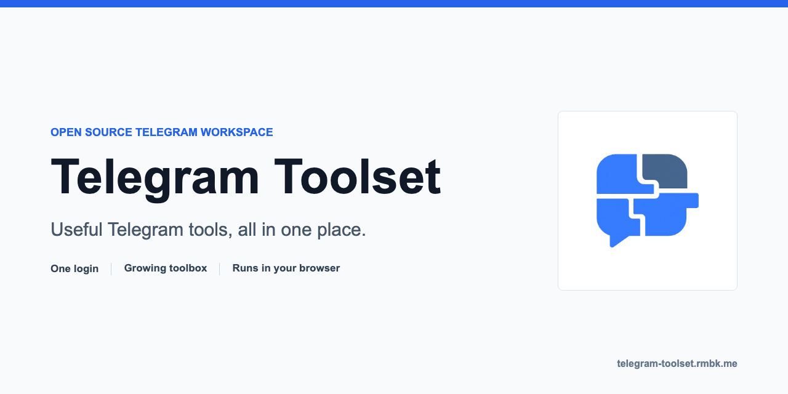

<p align="center">
  
</p>

# Telegram Toolset

Private, browser-based power tools for Telegram. Inspect accounts, export history, manage scheduled
messages, resend archives, and review your own messages before deleting them without sending your
data through somebody else's backend.

[**Open Telegram Toolset**](https://telegram-toolset.rmbk.me/) |
[Explore the tools](#tools) |
[Add a new tool](#adding-a-new-tool)

[](https://github.com/uburuntu/Telegram-Toolset/actions/workflows/ci.yml)
[](https://telegram-toolset.rmbk.me/)
[](./LICENSE)

> [!IMPORTANT]
> Telegram sessions and bot tokens stay in this browser. Sensitive account data is encrypted in
> IndexedDB with WebCrypto; there is no application backend, analytics service, or tracking pixel.

## Tools

| Tool | What it does | Account |
| --- | --- | --- |
| **Account Info** | Inspect profile metadata, security policies, active-session facts, and bot capabilities | User or bot |
| **Export Deleted Messages** | Export deleted messages from chats where you can read the admin log | User |
| **Backups** | Browse local exports and manage their ownership and recovery lifecycle | User |
| **Resend Messages** | Re-send an export with batching and attribution controls | User |
| **Scheduled Messages** | Find, filter, and manage scheduled messages across chats | User |
| **Delete My Messages** | Scan selected chats, preview the exact matches, then delete your own messages | User |
| **LLM Context Export** | Turn chat history into clean Markdown, JSON, or text for external tools | User |

## Why This Exists

- **Local first.** Telegram data is processed and stored on-device.
- **Review before mutation.** Destructive workflows separate discovery from action and show the
  exact scope before anything changes.
- **Honest outcomes.** Flood waits and transient reads retry safely; ambiguous mutations are reported
  as uncertain rather than silently treated as success.
- **One account platform.** User sessions and bot tokens share a multi-account shell without leaking
  credentials between accounts.
- **Built for real browsers.** Chromium, Firefox, WebKit, mobile Chrome, and mobile Safari are covered
  in CI, including a smoke test of the production bundle.

## How It Works

```text
Vue workspace
  |-- typed Telegram gateway -- GramJS / MTProto (user accounts)
  |-- Bot API client ---------- getMe (bot accounts)
  |-- account-affine jobs ----- cancellation, progress, outcome fencing
  `-- encrypted local storage - sessions, exports, backups, ownership metadata
```

Telegram is still the remote system of record. The app asks Telegram only for the data needed by the
tool you opened, handles rate limits centrally, and avoids media downloads when text metadata is
enough.

## Run Locally

Requirements: Node.js `22.14+` (Node 22) and the Corepack-pinned npm version from `package.json`.

```bash
corepack enable
npm ci
npm run dev
```

User-account tools require an API ID and hash from [my.telegram.org](https://my.telegram.org).
Bot accounts require a token from [@BotFather](https://t.me/BotFather).

For the complete quality gate:

```bash
npm run lint
npm run check:i18n
npm run type-check
npm run test:unit:coverage
npm run test:component:coverage
npm run build
npm run bundle:check
npm run test:e2e
npm run test:e2e:dist
```

<a id="adding-a-new-module"></a>

## Adding a New Tool

A good tool is a focused Telegram workflow that fits the shared account, gateway, job, storage, and
QA contracts. It should not bring its own login flow or duplicate a common selector.

1. Add the tool to [`src/modules/index.ts`](./src/modules/index.ts) with its route and compatible
   account type.
2. Build the lazy route under `src/modules/<tool>/` and reuse shared workspace components.
3. Use [`ChatSelector`](./src/components/telegram/ChatSelector.vue) with a tool-owned
   `ChatSelectorConfig` when the workflow selects chats.
4. Add Telegram operations to the appropriate typed gateway domain. Keep raw GramJS entities behind
   the adapter boundary.
5. Run long or destructive account-affine work through the job runtime, with cancellation and honest
   per-target outcomes.
6. Add every user-facing string to all 10 locales and cover service logic, component behavior, and
   the route's critical browser workflow.

The detailed checklist, module skeleton, and pull-request expectations live in
[`CONTRIBUTING.md`](./CONTRIBUTING.md).

## Project Map

| Path | Responsibility |
| --- | --- |
| [`src/modules/`](./src/modules) | Lazy tool workflows and their route-owned UI |
| [`src/components/`](./src/components) | Shared account, chat, storage, and shell components |
| [`src/services/telegram/gateway/`](./src/services/telegram/gateway) | Typed feature-facing Telegram boundary |
| [`src/services/jobs/`](./src/services/jobs) | Route-independent account-affine job ownership |
| [`src/services/storage/`](./src/services/storage) | IndexedDB, encrypted secrets, ownership, and recovery |
| [`src/i18n/locales/`](./src/i18n/locales) | Complete message catalogs for 10 locales |
| [`tests/`](./tests) | Unit, component, cross-browser E2E, and production smoke coverage |

Architecture constraints, browser integration lessons, and the design system are documented in
[`AGENTS.md`](./AGENTS.md).

## Contributing and Security

- Read [`CONTRIBUTING.md`](./CONTRIBUTING.md) before opening a substantial pull request.
- Report vulnerabilities privately using [`SECURITY.md`](./SECURITY.md). Never put Telegram
  credentials, session strings, bot tokens, or private chat content in a public issue.
- Historical desktop binaries remain available under Releases, but the current product is the web
  workspace linked above.

## License

[MIT](./LICENSE). Copyright 2024-2026 rmbk and contributors.
